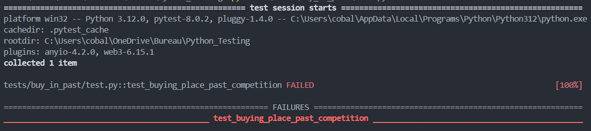
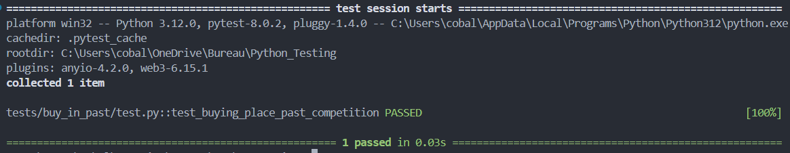

## Résumé du bug

Quand un user achete des places aucun check n'est fais pour déterminé si le tournois est fini ou pas
before fixing :


## Correction du bug 

Pour verifié j'ai rajouter un if qui vient vérifié si la date du tournois est pas déja passé :
```py
datetime.strptime(competition[0]["date"], "%Y-%m-%d %H:%M:%S") < datetime.now()
```

after fixing:


PS : j'ai aussi rajouté une compétition qui n'est pas fini, et un check pour acheter dans cette compétition dans le test

***