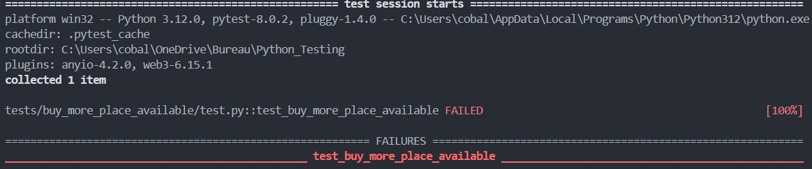
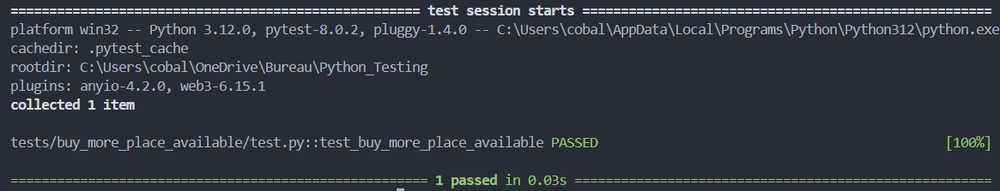

## Résumé du bug

Quand un user achete des places aucun check n'est fais sur la disponibilité de ces places.

before fixing:


## Correction du bug

Pour corriger ce bug j'ai rajouter une vérification si le nombre de place voulu est supérieur au nombre de places disponible
```py
if placesRequired > int(competition[0]["numberOfPlaces"])
```

after fixing:


***