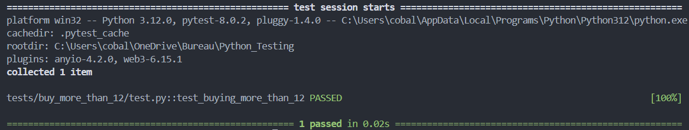

## Résumé du bug 

Quand un user souhaite acheter plus de 12 places aucun check n'est fais, voici la seule condition dans le code :
```py
if pointsclub < placesRequired
```
before fixing:


## Correction du bug

Pour corriger ce bug j'ai rajouter dans le `if` une verification que le nombre de places souhaité n'est pas supérieur a 12
```py
if pointsclub < placesRequired or placesRequired > 12
```

after fixing: 
