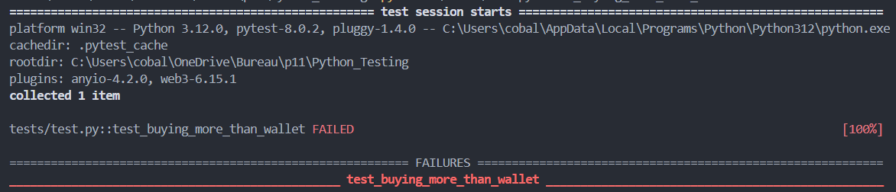
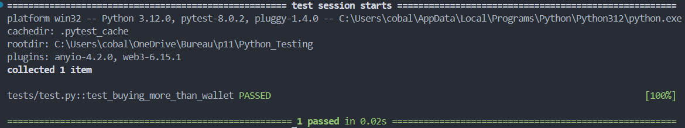

## Résumé du bug

Quand un user veut acheter des places on peut voir dans le code qu'aucun check en rapport avec son nombre de points n'est fait.
```py
competition = [c for c in competitions if c['name'] == request.form['competition']][0]
club = [c for c in clubs if c['name'] == request.form['club']][0]
placesRequired = int(request.form['places'])
competition['numberOfPlaces'] = int(competition['numberOfPlaces'])-placesRequired
```
before fixing :


## Correction du bug

Pour corriger ce bug nous allons donc ajouter `if` qui va venir faire un check sur le solde de l'utilisateur
```py
competition = [c for c in competitions if c['name'] == request.form['competition']]
if not competition:return abort(404) #added prevent crash
club = [c for c in clubs if c['name'] == request.form['club']]
if not club: return abort(404) #added prevent crash
placesRequired = int(request.form['places'])
pointsclub = int(club[0]["points"]) #added for issue 2
if pointsclub < placesRequired: #added for issue 2
    flash('Can\'t buy more than your points!')#added for issue 2
    return render_template('welcome.html', club=club[0], competitions=competitions)
```
after fixing: 


PS: j'ai aussi rajouter du code pour prévenir un crash (similaire du bug de l'email inconnue)

***