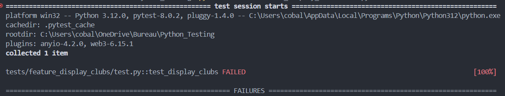
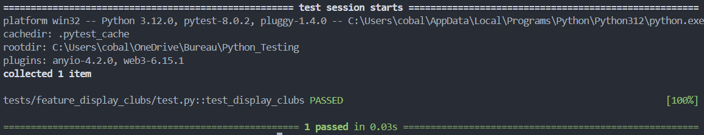

## Résumé de la feature

Cette  MAJ permets d'afficher le noms des autres clubs et leur nombres de points

before creation of feature :


## Description de la MAJ

J'ai modifié la template welcome pour recevoir de nouveau parametre `other_clubs`, j'ai fais une fonction pour retourné les clubs sans notre club actuel et je display leur name et leur nombre de points.

```py
def load_other(our_club):
    return  [club for club in clubs if club != our_club]
```

after creation of feature:
