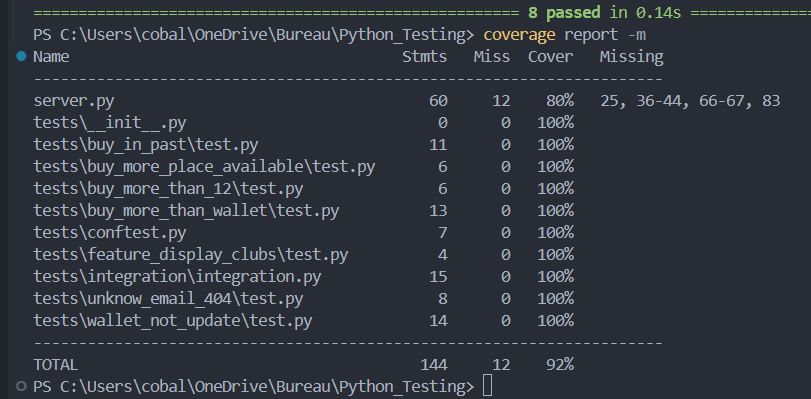

## Creation des test d'integrations

Pour crée le test d'integration, j'ai décidé d'importer les test deja crée et de les executer a la suite pour verifier differents points :
+ La feature est présente
+ Login correct sans crash
+ Achat de place dans le passé impossible
+ Achat de plus de places que disponible impossible
+ Achat de plus que son solde impossible
+ Achat de plus de 12 places impossible
+ Achat de place fonctionne correctement et les points sont retiré du wallet

Grace à l'outil coverage j'ai pu avoir un apercu du code couvert par mes tests : `80%` du code du ficher `server.py` à pu être tester.

