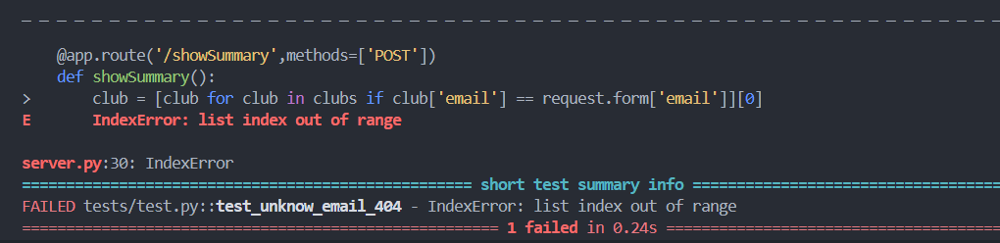

## Resumé du bug

Quand un user entre une email c'est ce code qui récupère les informations :
```py
club = [club for club in clubs if club['email'] == request.form['email']][0]
```
mais si l'email n'existe pas, alors cela crée un crash de l'application

Before fixing :


## Correction

Je vais donc récuperé le club, et vérifié si il n'existe pas, dans ce cas je renvoie un 404 :
```py
club = [club for club in clubs if club['email'] == request.form['email']]
if not club: return abort(404)
```

After fixing :


***