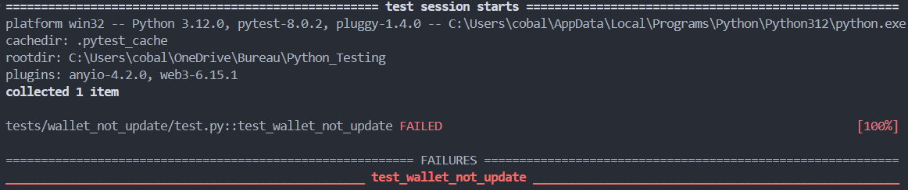
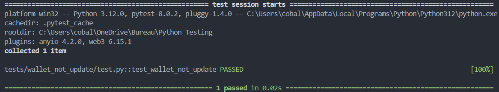

## Résumé du bug

Quand un user achete des places, aucun parti du code n'est dédié au retrait des points sur le wallet de l'utilisateur

before fixing:


## Correction du bug

Ajout d'une line de code pour enlever le nombre de places acheter au solde de l'utilisateur
```py
club[0]["points"] = int(club[0]["points"])-placesRequired
```

after fixing :
